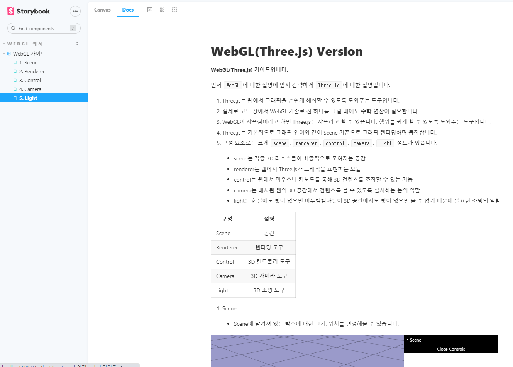

# storybook

## Project setup
```
yarn install
```

### Compiles and hot-reloads for development
```
yarn serve
```

### Compiles and minifies for production
```
yarn build
```

### Lints and fixes files
```
yarn lint
```

### Start StoryBook
```
yarn storybook
```

### Build StoryBook
```
yarn build-storybook
```

### Installing
Yarn
```
yarn
yarn global add sass
yarn add -D sass
yarn storybook
```
NPM
```
npm install
npm i -g sass
npm i sass --save-dev
npm run stroybook
```

### Customize configuration
See [Configuration Reference](https://cli.vuejs.org/config/).